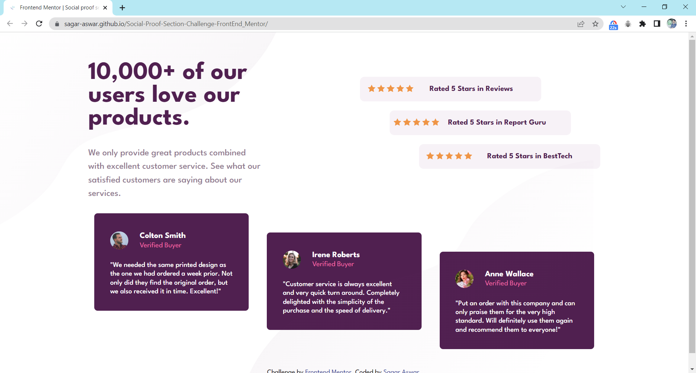

# Frontend Mentor - Social proof section solution

This is a solution to the [Social proof section challenge on Frontend Mentor](https://www.frontendmentor.io/challenges/social-proof-section-6e0qTv_bA). Frontend Mentor challenges help you improve your coding skills by building realistic projects. 

### Screenshot

### Links

- Live Site URL: [Click Here](https://sagar-aswar.github.io/Social-Proof-Section-Challenge-FrontEnd_Mentor/)

### Built with

- Semantic HTML5 markup
- CSS custom properties
- CSS Flexbox
- Media Queries

## Author

- Website - [Sagar Aswar](https://github.com/sagar-aswar)
- Frontend Mentor - [@sagar-aswar](https://www.frontendmentor.io/profile/sagar-aswar)
- Twitter - [@theSagarAswar](https://www.twitter.com/theSagarAswar)